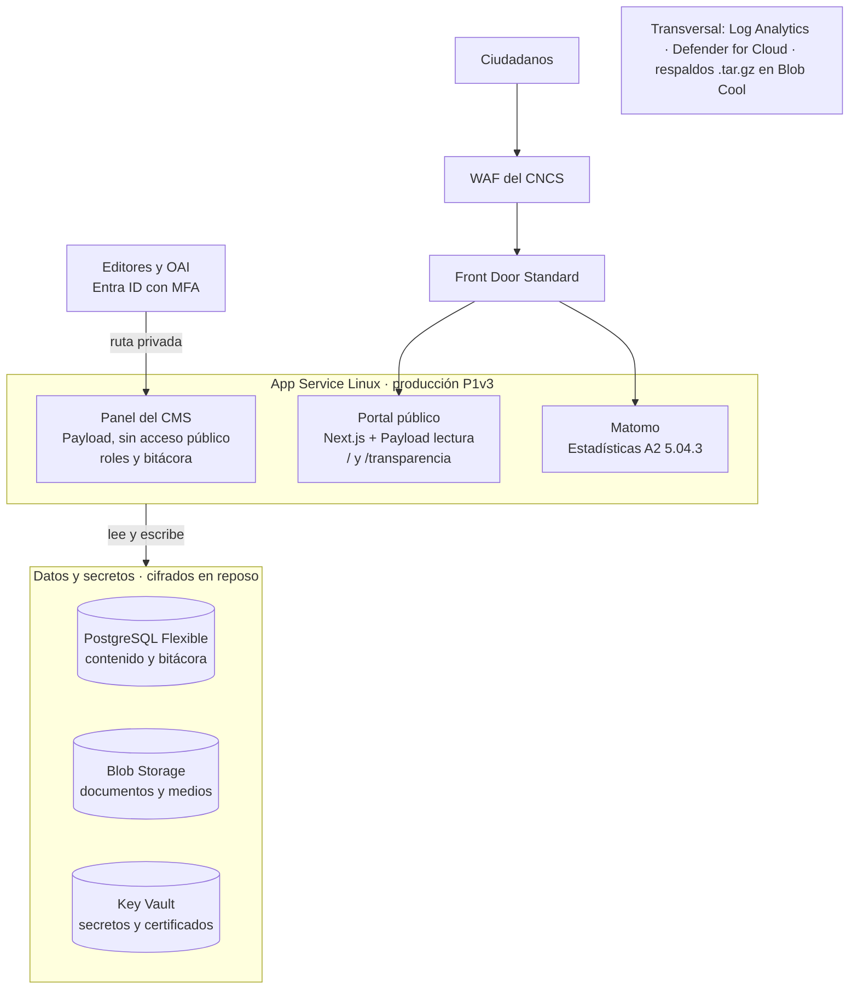

# Rediseño del Portal CORPHOTELS — Requerimientos y Arquitectura por Sprints

3 de octubre de 2026 · Julio Manuel Reyes León

> Este documento es el contexto de cada sprint. Las novedades detectadas durante el desarrollo se registran en [novedades.md](novedades.md); no se resuelven a criterio del desarrollo.

## Resumen ejecutivo

El portal corphotels.gob.do se reconstruye completo sobre Next.js + Payload CMS + PostgreSQL, con la sección de transparencia integrada, para obtener la certificación NORTIC A2:2023 y retirar el Joomla 3 sin soporte. El desarrollo lo ejecuta la División TIC con desarrollo asistido por IA, en 10 sprints: ocho en entorno local con paridad Azure y dos finales de despliegue y salida a producción.

**Alcance.** Portal institucional con la estructura obligatoria de la A2 (capítulo 4), catálogo de servicios conforme a la A5, sección de transparencia en `corphotels.gob.do/transparencia` (obligatoria según A2 5.01.b), migración del contenido y documentos del Joomla actual con redirecciones 301, y cumplimiento de seguridad A2 5.05 y NORTIC A8:2025.

**Fuera de alcance (fase posterior).** Portal privado de arrendatarios, pasarela de pagos, trámites transaccionales extremo a extremo, módulo de fomento al turismo y versión en inglés. La arquitectura queda preparada para incorporarlos sin rehacer la base.

**Reparto de responsabilidades.** Un proveedor llave en mano aprovisiona la infraestructura Azure (proceso CORPHOTEL-DAF-CM-2026-0009). La División TIC codifica el portal. El WAF lo provee el Centro Nacional de Ciberseguridad (CNCS).

## Decisiones tomadas

Once decisiones fijan el diseño; cualquier cambio a ellas se registra como novedad, no se resuelve a criterio del desarrollo.

| Tema | Decisión | Fundamento |
| --- | --- | --- |
| Plataforma | Next.js (App Router) + TypeScript + Payload CMS 3 + PostgreSQL | A2 5.02 exige un CMS con categorías, menús, medios, roles, complementos, URL amigables y SEO; Payload corre dentro de Next.js y usa PostgreSQL nativo |
| Estadísticas | Matomo autohospedado en Azure | A2 5.04.3 lista las métricas mínimas; evita enviar datos de visitantes a terceros (Ley 172-13) |
| Transparencia | Integrada al portal, en `/transparencia` | A2 5.01.b; elimina la segunda instalación Joomla |
| Diseño | Sistema de Diseño Dominicano, azul `#0F539C` como primario | A2 1.06 y 2.01.f; el `#1A4072` de CORPHOTELS solo donde el SDD lo permita |
| Idioma | Solo español en esta fase | A2 2.01.c.vii exige versión completa por idioma |
| Entorno de desarrollo | Local, con Docker y paridad con Azure | Decisión TIC; reduce costo de consumo durante la construcción |
| Despliegue | Al final, sprints S8–S9 | Decisión TIC |
| Infraestructura | Aprovisionada por proveedor llave en mano | Proceso CORPHOTEL-DAF-CM-2026-0009, punto 17 |
| WAF | Servicio del CNCS | Decisión TIC; cubre A2 5.05.d |
| Autenticación del CMS | Entra ID corporativo con MFA obligatorio | A2 5.05.o, A8 3.01.3 |
| Fase 2 | Arrendatarios, pagos, trámites transaccionales, turismo | Dependen del ERP, de la Ley 32-23 y de procesos de compra |

## Identidad visual y activos de marca

El kit oficial de CORPHOTELS fija el azul medianoche `#1A4072` y el rojo caribe `#EB282E`; reemplazan los valores aproximados tomados del portal actual (`#173F6F` y `#EB252C`), que no deben usarse.

### Colores

| Color | Hex | RGB | Contraste sobre blanco | Uso permitido |
| --- | --- | --- | --- | --- |
| Azul medianoche | `#1A4072` | 26, 64, 114 | 10.4:1 | Texto, logotipos, fondo de cabecera opción B |
| Rojo caribe | `#EB282E` | 235, 40, 46 | 4.3:1 | Acentos, íconos, texto de 18 pt o más (14 pt en negrita); nunca texto normal |
| Azul SDD | `#0F539C` | 15, 83, 156 | 7.7:1 | Color primario de los componentes SDD |

El rojo sobre blanco no alcanza el 4.5:1 que exige la A2 7.01.i para texto normal, y el rojo sobre azul medianoche da 2.4:1: esa combinación no se usa. Sustituir el azul SDD por el azul medianoche en componentes o en el fondo de cabecera requiere validación de OGTIC (A2 3.02.a.iii).

### Logotipos y su uso en el portal

Los archivos están en `public/brand/` (SVG para uso web; PNG como respaldo).

| Activo (SVG, PNG, PDF) | Uso | Directriz |
| --- | --- | --- |
| Icono (escudo), azul y blanco | Cabecera: icono a 40 px (escritorio) o 44 px (móvil) seguido del nombre del organismo en texto HTML; pie: isotipo a 56 px | A2 3.02.b, 3.04.a, 3.02.f.i |
| Gobierno de la República, azul y blanco | Pie: logo de Gobierno a 80 px (escritorio) y 75 px (móvil) | A2 3.02.f, 3.04.c |
| Logo horizontal y logo centralizado | Imagen para redes (Open Graph), Quiénes somos, documentos descargables; no en la cabecera | — |
| Favicon (33×33) | Generar `favicon.ico` y PNG de 16×16 px desde el SVG | A2 2.01.a |
| Icono de escritorio (49×49) | Generar íconos de 180, 192 y 512 px desde el SVG | — |
| Cúpula | Reserva; el identificador oficial usa la bandera, no la cúpula | A2 4.01.b |

Variante azul para la cabecera opción A (fondo blanco) y variante blanca para la opción B (fondo azul). El logo horizontal no va en la cabecera: a 40 px de alto su subtítulo queda ilegible, y la A2 pide además el nombre del organismo como texto. CORPHOTELS tiene identidad propia, distinta de la línea gráfica de Presidencia, por lo que el pie lleva el isotipo junto al logo de Gobierno (A2 3.02.f.i); su aplicabilidad se confirma con DIECOM (A2 3.02.b).

### Tipografía

Futura PT (ParaType, 22 estilos OTF) es la tipografía de la marca. Los logotipos SVG ya tienen el texto trazado, así que no dependen de la fuente. El texto del portal usa la tipografía del SDD. Usar Futura PT en la web requiere licencia web de ParaType, que la licencia de escritorio no cubre, y validación de OGTIC; los archivos OTF no se suben al repositorio.

## Marco normativo aplicable

La NORTIC A2:2023 es la norma certificable del proyecto; la A8:2025 sustenta los controles de seguridad y las demás normas condicionan contenido, datos y operación.

| Instrumento | Materia | Aplicación en el portal |
| --- | --- | --- |
| [NORTIC A2:2023](https://ogtic.gob.do/normativas/nortic-a2-2023/) | Desarrollo y gestión de portales web y transparencia | Norma rectora; objetivo de certificación |
| [NORTIC A7:2025](https://ogtic.gob.do/herramientas/nortic-a7-2025/) | Administración de la seguridad de la información | Gobierno de seguridad, Declaración de Aplicabilidad |
| [NORTIC A8:2025](https://ogtic.gob.do/wp-content/uploads/2025/12/NORTIC-A8_2025-.pdf) | Ciberseguridad | MFA, cifrado, logs, SDLC seguro, incidentes |
| [NORTIC A9:2025](https://ogtic.gob.do/wp-content/uploads/2025/12/NORTIC-A9_2025.pdf) | Riesgos tecnológicos y continuidad | RTO/RPO, plan de recuperación |
| NORTIC A5:2019 | Prestación y automatización de servicios | Ficha de 15 campos por servicio |
| NORTIC A3:2014 | Datos abiertos | Formatos de publicación en transparencia |
| NORTIC E1:2022 | Redes sociales | Enlaces e íconos oficiales |
| NORTIC A4:2024 | Interoperabilidad | Preparación arquitectónica (fase 2) |
| Sistema de Diseño Dominicano | Línea gráfica del Estado | Componentes visuales ([sdd-lib](https://github.com/opticrd/sdd-lib)) |
| Ley 200-04 y Decreto 130-05 | Libre acceso a la información | Sección de transparencia |
| Decreto 166-25 | Sanciones por incumplimiento de transparencia | Plan de corte sin afectar evaluaciones DIGEIG |
| Resolución DIGEIG 002-2021 (o la vigente) | Estandarización de portales de transparencia | Estructura de menú de transparencia |
| Ley 172-13 | Protección de datos personales | Privacidad, consentimiento, cookies |
| Ley 53-07 | Crímenes de alta tecnología | Protección de sistemas |
| Ley 126-02 | Comercio electrónico y firma digital | Autenticidad de documentos |
| Ley 107-13 | Derechos ante la administración | Atención digital al ciudadano |
| Ley 42-2000 (verificar sustitución por Ley 5-13) | Discapacidad | Accesibilidad |
| Decreto 685-22 | Notificación de incidentes | Reporte al CSIRT en 24 horas |
| Decretos 709-07, 229-07, 707-22 | Obligatoriedad de las NORTIC | Base de cumplimiento |
| Decreto 175-08 | Dominios .gob.do | Dominio institucional |
| Decreto 694-09 | Sistema 311 | Enlace obligatorio |
| Resolución MAP 012-2015 | Observatorio de servicios públicos | Enlace obligatorio |
| Resolución MAP 078-2026 | Tecnología en la nube | Alojamiento en Azure |

## Requerimientos NORTIC A2:2023

Cada requerimiento lleva su directriz de origen y el sprint que lo cumple; la columna Sprint es la que se verifica en la preauditoría de S9. Las directrices de seguridad 5.05 están en la sección siguiente.

### Capítulo 1 — Política y Sistema de Diseño

| Directriz | Requerimiento | Sprint |
| --- | --- | --- |
| 1.06.a | Política de Gestión de Portales Web: alcance, responsables (contenido, servicios, desarrollo, seguridad), procedimientos de cambio, gestión de contraseñas | Institucional |
| 1.06.a.i | Responsable del portal (webmaster) designado | Institucional |
| 1.06.a.ii | Cambios mayores al portal y transparencia consultados con el CIGETIC | Institucional |
| 1.06.a.iii, 2.01.f | Componentes según el SDD: encabezados, botones, enlaces, texto, imágenes, listas, formularios, destacados, alertas | S0 |
| 1.06.b | Política firmada por la MAE, la máxima autoridad TIC y Planificación | Institucional |

### Capítulo 2 — Usabilidad

| Directriz | Requerimiento | Sprint |
| --- | --- | --- |
| 2.01.a | Favicon con el logo, 16×16 px, ICO o PNG | S0 |
| 2.01.b.i–iv | Menú activo resaltado, cambio de cursor, rastro de navegación, encabezado igual al texto del enlace | S0 |
| 2.01.b.vi–ix | Trámites por pasos con indicador de etapa; campos requeridos marcados; validación previa; límite de caracteres | S3 |
| 2.01.b.x | Confirmación de trámite: número de caso, tiempo de entrega, vías de contacto, enlace a privacidad | S3 |
| 2.01.b.xi | Confirmación de sugerencias: tiempo de respuesta y vías de contacto | S3 |
| 2.01.b.xii | Error 404 con identidad gráfica, estructura del portal y sugerencias | S0 |
| 2.01.b.xiii | Descargas con descripción, tamaño, fecha de creación y tipo | S1 |
| 2.01.c | Lenguaje simple, sin argot, sin errores, siglas desglosadas, nombre formal y coloquial, unidades SI | S2, S5 |
| 2.01.d | Logo y nombre enlazan al inicio | S0 |
| 2.01.e | Botones de imprimir, exportar a PDF y enviar por correo | S2 |
| 2.01.g | Enlaces externos y descargas en pestaña nueva | S0 |
| 2.01.h | Navegación, mensajes y alertas siempre en la misma posición | S0 |
| 2.01.i.i | Guía de uso al inicio de cada herramienta o proceso | S3 |
| 2.01.i.ii | Buscador: maneja consulta vacía, ordena por relevancia, sin duplicados, muestra cantidad de resultados | S6 |
| 2.02.a | Móvil: iconos claros, historial de datos no sensibles, sin vistas modales, imágenes optimizadas | S0, S2 |
| 2.02.b, 3.01.b.vii | El identificador oficial se oculta al desplazar; cabecera y menú quedan fijos | S0 |

### Capítulo 3 — Disposición de elementos

| Directriz | Requerimiento | Sprint |
| --- | --- | --- |
| 3.01.a–b | Diseño responsivo; tres divisiones (cabecera, contenido, pie) centradas e iguales en todo el sitio; sin superposiciones; sin redirección automática | S0 |
| 3.02.a | Cabecera opción A (fondo blanco, identificador azul) u opción B (fondo azul, identificador blanco) | S0 |
| 3.02.b | Cabecera escritorio: identificador 27/150 px, logo ≤ 40 px, nombre, buscador 40×246 px, menú de enlaces de interés 32×32 px, menú principal 56 px | S0 |
| 3.02.e | Contenido en cinco paneles; superior solo para rastro de navegación; panel izquierdo de transparencia con su menú vertical | S0, S4 |
| 3.02.f | Pie: logo Gobierno ≤ 80 px, Conócenos, contactos, Búscanos, Infórmate, copyright con año, sellos NORTIC 100×100 px, redes oficiales ≤ 16 px a color sin plugin | S0 |
| 3.02.g–h | Menú principal horizontal con submenús; menú de transparencia vertical | S0, S4 |
| 3.04.a | Cabecera móvil: logo ≤ 44 px, nombre, buscador 28×28 px, menú hamburguesa 42×44 px; submenús hasta nivel II | S0 |
| 3.04.c | Pie móvil: logo Gobierno ≤ 75 px, sellos en pestaña desplegable, máximo 4 redes sociales | S0 |

### Capítulo 4 — Contenido

| Directriz | Requerimiento | Sprint |
| --- | --- | --- |
| 4.01.a | No cambiar orden ni nombres de la estructura obligatoria | S2, S4 |
| 4.01.b | Identificador oficial: bandera, desplegable de verificación, mensaje de portal oficial | S0 |
| 4.01.c | Menú de enlaces de interés: Ventanillas, Portales (dominicana.gob.do, gob.do, 311, 911, Observatorio, becas.gob.do, IWF, divulgación responsable del CNCS), Instituciones relacionadas | S0 |
| 4.01.d–e | Fuente externa citada al final con enlace directo | S2 |
| 4.01.f–h | Sin publicidad; sin formularios de acceso a administración o sistemas internos; sin secciones vacías ni en mantenimiento | S0, S1 |
| 4.02 | Estructura: Inicio; Sobre nosotros (Quiénes somos, Historia, Organigrama descargable, Conoce al Gerente General, Marco legal descargable); Servicios; Transparencia; Noticias (título, fecha, lugar, imagen, fuente; actualización mensual); Contactos (dirección, apartado, mapa, teléfono, correo); Términos de uso; Política de privacidad; Preguntas frecuentes | S2 |
| 4.02.b | Ficha de servicio con los 15 campos de la A5 | S3 |
| 4.03 | Transparencia: 19 secciones según la resolución DIGEIG vigente; enlace al Portal Único de Transparencia | S4 |
| 4.04 | Transparencia móvil en 5 grupos: Institucional, Legal, OAI, Servicios, Financiero, más Contactos | S4 |

### Capítulo 5 — Administración (5.01–5.04)

| Directriz | Requerimiento | Sprint |
| --- | --- | --- |
| 5.01.a, c | Dominio corphotels.gob.do | Existente |
| 5.01.b | Transparencia en `corphotels.gob.do/transparencia` | S4 |
| 5.02.a | CMS con etiquetas y categorías, menús, medios, usuarios con roles, complementos confiables, plantillas, URL amigables, comunidad de soporte, herramientas SEO | S1 |
| 5.02.a | Ruta del panel modificable; sin complementos desactualizados; versiones estables con al menos 6 meses (interpretación a confirmar) | S1 |
| 5.02.a.i | Créditos de licencias de código abierto en el código fuente | S1 |
| 5.03 | CIGETIC conformado por resolución firmada y sellada | Institucional |
| 5.04.1 | Pruebas de usabilidad (éxito ≥ 80%), índice de eficiencia, encuesta SUS anual (≥ 70%), encuesta al final de cada trámite | S3, S9 |
| 5.04.2 | Métricas de velocidad, complejidad de contenido y comportamiento (error, rebote, páginas principales) | S7 |
| 5.04.3 | Estadísticas: cambios, visitantes únicos y recurrentes, páginas por visita, abandono, tiempo, comparación de periodos, páginas populares, fuentes, palabras clave, conversiones, ruta de clics; informes al CIGETIC | S6 |

### Capítulo 6 — Optimización en buscadores

| Directriz | Requerimiento | Sprint |
| --- | --- | --- |
| 6.01.a–b | Sin contenido duplicado; título único por página; jerarquía h1–h6 | S6 |
| 6.01.c | Enlaces con texto ancla descriptivo; sin enlaces inorgánicos ni recíprocos | S6 |
| 6.01.d–e | Título: página, sitio, palabras clave; meta descripción propia por página | S6 |
| 6.01.f, h | URL cortas, en minúsculas, sin tildes, caracteres especiales ni parámetros innecesarios | S1 |
| 6.01.g | Redirecciones 301 por cambio de CMS; URL canónicas | S5 |
| 6.01.i | Mapa del sitio en HTML, `sitemap.xml`, página 404 indexada con enlace al inicio | S6 |
| 6.01.j, l | Control NoIndex por página; marcado semántico | S6 |

### Capítulo 7 — Accesibilidad (WCAG 2.2 AA)

| Directriz | Requerimiento | Sprint |
| --- | --- | --- |
| 7.01.a–c | Texto alternativo; ancho y alto declarados en imágenes; etiquetas en todos los campos | S0, S1 |
| 7.01.d | HTML válido, bien anidado, sin atributos duplicados | S7 |
| 7.01.e, j, k | Orden de foco lógico; navegación completa por teclado; enlace para saltar bloques | S0 |
| 7.01.f–g | Instrucciones no dependen solo de color o forma; errores descritos en texto | S0, S3 |
| 7.01.h–i | Ambas orientaciones; contraste 4.5:1 (3:1 en texto grande) | S0 |
| 7.01.l–m | Título por página; portada titulada "Corporación de Fomento de la Industria Hotelera y Desarrollo del Turismo (CORPHOTELS)" | S0 |
| 7.01.n–p | Enlaces descriptivos; idioma declarado; nombre, rol y valor en cada control | S0 |
| 7.01.q–s | Sin enlaces rotos; compatible con navegadores soportados; legible sin hojas de estilo | S6, S7 |
| 7.01.t–w | Sin recarga automática; texto ampliable al 200%; herramienta de tamaño de texto y contraste; sin reproducción automática ni ventanas emergentes | S0 |
| 7.01.x–z | Opción de cancelar procesos; disponibilidad continua; sin cambio de contexto al recibir foco | S3, S8 |

## Requerimientos de seguridad

La A2 5.05 fija el mínimo del portal y la A8:2025 lo amplía; los controles de aplicación los construye TIC y los de plataforma los entrega el proveedor o el CNCS.

### Controles de aplicación (construye TIC)

| Origen | Requerimiento | Sprint |
| --- | --- | --- |
| A2 5.05.d.i–iii | Protección contra inyección SQL, CSRF y XSS en todos los formularios | S1, S7 |
| A2 5.05.e | Datos de usuarios cifrados en tránsito y en reposo; formularios solo por POST, nunca GET; longitud y formato validados | S3 |
| A2 5.05.h–i | Protección contra inyección de encabezados de correo e inyección de comandos del sistema operativo | S3, S7 |
| A2 5.05.j | Errores sin información del servidor, claves ni rutas internas | S7 |
| A2 5.05.n | Todo software de administración en su última versión estable; análisis de dependencias en el pipeline | S7 |
| A2 5.05.o, A8 3.01.3 | MFA obligatorio para todo usuario del CMS, vía Entra ID | S1 |
| A8 3.01.5 | Roles con mínimo privilegio y separación de funciones (editor, publicador, OAI, administrador, auditor) | S1 |
| A8 3.01.5.d, 3.04.3 | Bitácora append-only de autenticación, permisos y publicaciones, enviada a Log Analytics | S1, S8 |
| A8 3.04.4 | SDLC documentado: análisis estático, pruebas dinámicas, revisión de código, OWASP Top 10 | S7 |
| A8 3.03 | Cabeceras HSTS, CSP, X-Frame-Options, X-Content-Type-Options, Referrer-Policy, Permissions-Policy | S7 |
| Ley 172-13, A2 4.02.g | Política de privacidad, consentimiento explícito en formularios, banner de cookies no modal | S2 |

### Controles de plataforma (entrega proveedor o CNCS)

| Origen | Requerimiento | Responsable |
| --- | --- | --- |
| A2 5.05.a, A9 | Disponibilidad y continuidad operativa; PostgreSQL con alta disponibilidad por zona | Proveedor |
| A2 5.05.b | Antimalware o detección y respuesta en los servidores | Proveedor (Defender for Cloud) |
| A2 5.05.c | IDS pasivo e IPS con firmas, monitoreo de red y aplicación, consola central, escaneo de protocolos, alertas por correo, syslog o SNMP, reglas personalizadas | Por confirmar: Defender, CNCS o ambos |
| A2 5.05.d | WAF con filtrado por reglas, direcciones, puertos y protocolos | CNCS |
| A2 5.05.g, A8 3.03.2 | HTTPS con TLS 1.2 o superior; SSLv2, SSLv3, 3DES y RC4 deshabilitados | Proveedor y CNCS |
| A2 5.05.k–l | Respaldos automáticos, remotos y cifrados; archivos en formato ZIP, GZIP o tar | Proveedor |
| A2 5.05.m | Informe de pruebas de vulnerabilidad al menos una vez al año | Proveedor |
| A8 3.03.1 | Secretos y claves en Key Vault con rotación | Proveedor |
| A8 4.01 | Logs centralizados con alertas por umbral | Proveedor |
| A8 5.03.1, Decreto 685-22 | Incidentes reportados al CSIRT Nacional en 24 horas | TIC |
| A8 2.03.2 | Prueba de penetración antes de producción | TIC (contratación) |

### Política de contraseñas y privilegios (A2 5.05.o)

Es un documento institucional, requisito de la certificación. Debe cubrir: cambio de usuarios y contraseñas por defecto; MFA; mínimo 8 caracteres con mayúsculas, minúsculas, números y símbolos; personal autorizado; gestor de contraseñas; mínimo privilegio; procedimiento de traspaso ante cambios de personal; y constancia firmada de lectura y aceptación por todo el personal con acceso al portal.

## Arquitectura de la solución

Una sola aplicación Next.js aloja el portal público y Payload CMS, sobre PostgreSQL y Blob Storage; el panel de administración se despliega como app separada sin acceso público, y Matomo mide el tráfico dentro del entorno institucional.

El WAF del CNCS es la única entrada pública; el App Service rechaza tráfico que no venga de él. Editores y OAI entran al panel por una ruta privada con Entra ID y MFA, lo que cumple A2 4.01.g.

### Stack

| Capa | Tecnología | Motivo |
| --- | --- | --- |
| Aplicación | Next.js (App Router) + TypeScript, Node.js LTS | Renderizado en servidor para SEO y rendimiento |
| CMS | Payload CMS 3 (licencia MIT) | Cumple A2 5.02; vive dentro de Next.js; adaptadores oficiales de PostgreSQL y Azure Blob |
| Base de datos | PostgreSQL | Requerido por el habilitador; búsqueda de texto completo nativa en español |
| Diseño | Componentes SDD + Tailwind CSS | A2 1.06 y 2.01.f |
| Estadísticas | Matomo (GPL) autohospedado | A2 5.04.3 sin terceros |
| Autenticación | Entra ID corporativo (OIDC) con MFA | A2 5.05.o, A8 3.01 |
| CI/CD | GitHub Actions con despliegue OIDC | Sin secretos estáticos |
| Empaquetado | Docker | Misma imagen en local y en Azure |

### Paridad entre local y Azure

El código solo depende de la configuración, nunca del lugar donde corre; S8 cambia variables y despliega la misma imagen.

| Azure | Equivalente local |
| --- | --- |
| App Service Linux | Contenedor Docker con la imagen de producción |
| PostgreSQL Flexible Server | PostgreSQL en Docker, misma versión mayor |
| Blob Storage | Azurite |
| Key Vault | Archivo `.env`, leído por la misma capa de configuración |
| Entra ID | Registro de aplicación de desarrollo con redirección a `localhost` |
| Communication Services | Mailpit |
| Matomo en App Service | Matomo en Docker |

### Uso de los componentes contratados

| # | Componente del proceso | Uso en el portal |
| --- | --- | --- |
| 1 | App Service P1v3 | Portal, panel del CMS y Matomo en producción |
| 2 | App Service S1 | Desarrollo y QA |
| 3 | PostgreSQL General Purpose con alta disponibilidad | Base de producción |
| 4 | PostgreSQL Burstable | Base de desarrollo y QA |
| 5 | Entra External ID | Reservado para arrendatarios (fase 2) |
| 6 | Entra ID corporativo | Acceso al CMS con MFA |
| 7 | Front Door + WAF | Front Door Standard detrás del WAF del CNCS |
| 8 | Blob Hot | Documentos, imágenes y medios |
| 9–10 | Blob Cool y Azure Backup | Respaldos y archivo del Joomla retirado |
| 11 | Defender for Cloud | Postura de seguridad y antimalware (A2 5.05.b) |
| 12 | Monitor y Log Analytics | Logs, alertas y métricas de rendimiento |
| 15–16 | Azure Migrate y VPN | No aplican al portal |

## Requerimientos de infraestructura para el proveedor

El proveedor llave en mano entrega la plataforma configurada y probada antes del inicio de S8; TIC solo despliega código sobre ella.

| # | Entregable | Especificación |
| --- | --- | --- |
| 1 | Ambientes | Desarrollo/QA (App Service S1, PostgreSQL Burstable) y producción (App Service P1v3, PostgreSQL General Purpose con alta disponibilidad por zona), en grupos de recursos separados |
| 2 | Aplicaciones | Tres apps en producción: portal público, panel del CMS (sin acceso público) y Matomo; slots de despliegue para publicar sin interrupción |
| 3 | Identidad | Identidades administradas para que las apps lean Key Vault y Blob sin contraseñas; registro de aplicación en Entra ID para el CMS con MFA y acceso condicional |
| 4 | Secretos | Key Vault con secretos y certificados; rotación documentada |
| 5 | Almacenamiento | Blob Hot para documentos y medios; Blob Cool para respaldos y archivo histórico; cifrado en reposo |
| 6 | Respaldos | Respaldos administrados de PostgreSQL más exportaciones diarias `pg_dump` en `.tar.gz` cifradas en Blob Cool (A2 5.05.l); prueba de restauración documentada |
| 7 | Red y entrada | Front Door Standard (TLS, dominio, caché) detrás del WAF del CNCS; App Service acepta solo tráfico del WAF; TLS 1.2+ sin cifrados débiles |
| 8 | Correo | Azure Communication Services (Email) con SPF, DKIM y DMARC sobre el dominio, o relé del Exchange de Microsoft 365 existente |
| 9 | Monitoreo | Log Analytics recibiendo logs de apps, base de datos y Front Door; alertas por disponibilidad, errores y autenticación |
| 10 | Seguridad | Defender for Cloud activo en App Service, PostgreSQL y Storage |
| 11 | Despliegue | Credencial federada (OIDC) para que GitHub Actions despliegue sin secretos estáticos |
| 12 | Registro de contenedores | Azure Container Registry Basic, si el despliegue es por contenedor |
| 13 | Documentación | Diagrama de red, inventario de recursos con SKU y región, accesos entregados, procedimiento de respaldo y restauración |
| 14 | Informe anual | Pruebas de vulnerabilidad de la plataforma (A2 5.05.m) |

Los recursos 4, 8 y 12 no están en la lista del proceso; se cubren con los créditos de consumo. Microsoft Sentinel queda como decisión institucional: la A8 4.01.2 pide correlación de eventos y Log Analytics solo los centraliza.

## Plan de sprints

Diez sprints: S0–S7 se construyen y prueban en local con paridad Azure; S8 despliega sobre la plataforma del proveedor y S9 sale a producción y solicita la certificación. Cada sprint cierra con su criterio "Listo cuando" verificado y un commit etiquetado en `main`.

**Reglas para todas las sesiones de Claude Code:** este documento es el contexto de cada sprint; permisos por rol desde el primer día; bitácora append-only; cada requerimiento cita su directriz; ninguna ambigüedad se resuelve a criterio del modelo, se lista como novedad.

### S0 — Fundaciones locales e identidad SDD

- **Objetivo:** esqueleto listo para construir, ya con la identidad del Estado.
- **Entregables:** repositorio en GitHub; Next.js + TypeScript; Docker Compose con PostgreSQL (misma versión mayor que Azure), Azurite, Mailpit y Matomo; capa de configuración única (`.env` local, Key Vault en Azure); activos de marca oficiales en `/public/brand/` (SVG del kit, variantes azul y blanca); componentes SDD: identificador oficial desplegable, cabecera opción A o B, menú principal, menú de enlaces de interés, rastro de navegación, pie institucional, página 404; herramienta de tamaño de texto y contraste; enlace para saltar bloques; favicon de 16×16 px e íconos de 180, 192 y 512 px generados desde los SVG oficiales.
- **Listo cuando:** `docker compose up` levanta todo; cabecera y pie cumplen las medidas de A2 3.02 y 3.04 en escritorio y móvil; el identificador se oculta al desplazar; contraste ≥ 4.5:1 verificado.

### S1 — CMS, roles y medios

- **Objetivo:** el equipo de Comunicaciones puede publicar.
- **Entregables:** Payload CMS 3 en PostgreSQL; panel en ruta no predeterminada; inicio de sesión con Entra ID y MFA; roles editor, publicador, OAI, administrador y auditor; colecciones de páginas, noticias, categorías, etiquetas, menús y medios; gestor documental con descripción, tamaño, fecha y tipo; almacenamiento en Blob (Azurite en local); URLs en minúsculas sin tildes; bitácora de acciones administrativas; créditos de licencias.
- **Listo cuando:** un editor crea una noticia y un publicador la aprueba; un documento muestra sus cuatro metadatos; un usuario sin MFA no entra.

### S2 — Portal institucional

- **Objetivo:** estructura obligatoria de A2 4.02 completa.
- **Entregables:** Inicio (servicios, noticias, banners); Sobre nosotros (Quiénes somos, Historia, Organigrama descargable, Conoce al Gerente General, Marco legal por tipo y fecha); Noticias con título, fecha, lugar, imagen y fuente; Contactos con mapa; Términos de uso; Política de privacidad; Preguntas frecuentes; botones de imprimir, PDF y correo; banner de cookies no modal; redes sociales (máximo 4 en móvil).
- **Listo cuando:** los 9 apartados existen con los nombres exactos de la norma y sin secciones vacías.

### S3 — Servicios y formularios

- **Objetivo:** catálogo A5 y formularios conformes.
- **Entregables:** ficha de servicio con los 15 campos de la A5; motor de formularios (contacto, sugerencias, solicitudes) por pasos, con indicador de etapa, campos requeridos marcados, validación, límite de caracteres, solo POST, protección CSRF; confirmación con número de caso, tiempo, vías de contacto y enlace a privacidad; consentimiento Ley 172-13; correo transaccional; encuesta de satisfacción al finalizar.
- **Listo cuando:** un ciudadano envía una sugerencia y recibe número de caso en pantalla y por correo; los datos quedan cifrados en reposo.

### S4 — Transparencia integrada

- **Objetivo:** `/transparencia` con la estructura DIGEIG vigente.
- **Entregables:** menú vertical de 19 secciones (escritorio) y 5 grupos (móvil); subsecciones de solo documentos como menú de archivos; carga por la OAI con su rol; enlaces a SAIP, 311, Portal Único de Transparencia y datos.gob.do; publicación periódica por categoría y año.
- **Listo cuando:** la OAI carga un documento en cada sección y la estructura coincide con la resolución DIGEIG confirmada.

### S5 — Migración de contenido

- **Objetivo:** todo el contenido útil del Joomla, sin romper enlaces.
- **Entregables:** extractor de la base de datos de ambos Joomla (portal y transparencia); migración de documentos a Blob con metadatos; tabla de equivalencias ID antiguo → URL nueva; redirecciones 301 para `index.php/...` y `?download=ID`; informe de contenido descartado y errores heredados para revisión de cada dueño.
- **Listo cuando:** el 100% de las URLs indexadas responde 301 a su destino o tiene justificación documentada.

### S6 — Buscador, SEO y estadísticas

- **Objetivo:** encontrabilidad y medición.
- **Entregables:** buscador con búsqueda de texto completo de PostgreSQL (consulta vacía, relevancia, sin duplicados, conteo); títulos y meta descripciones por página; mapa del sitio HTML y `sitemap.xml`; URL canónicas; marcado Schema.org; control NoIndex; Matomo con las métricas de A2 5.04.3 y plantilla de informe al CIGETIC.
- **Listo cuando:** el buscador cumple los cuatro criterios de A2 2.01.i.ii y Matomo registra visitas sin cookies de terceros.

### S7 — Endurecimiento y calidad

- **Objetivo:** cero hallazgos críticos o altos en la aplicación.
- **Entregables:** cabeceras de seguridad; manejo de errores sin fugas; análisis estático y de dependencias en GitHub Actions; pruebas dinámicas (OWASP ZAP) contra el entorno local; validación de HTML; auditoría WCAG 2.2 AA (axe, lector de pantalla, teclado); métricas de rendimiento (Lighthouse ≥ 90); documentación del SDLC.
- **Listo cuando:** el pipeline bloquea cualquier vulnerabilidad crítica o alta y las pruebas de accesibilidad pasan en las plantillas principales.

### S8 — Despliegue en Azure

- **Objetivo:** el portal corre en la plataforma del proveedor.
- **Entregables:** recepción y verificación de los 14 entregables del proveedor; despliegue por GitHub Actions con OIDC a QA y producción; migración de base de datos y documentos; configuración leída de Key Vault; logs en Log Analytics; prueba de restauración de respaldo.
- **Listo cuando:** QA y producción funcionan bajo dominio temporal con los mismos resultados de S7, y un respaldo se restaura con éxito.

### S9 — Salida a producción y certificación

- **Objetivo:** corphotels.gob.do servido por el nuevo portal y el Joomla apagado.
- **Entregables:** integración con el WAF del CNCS; prueba de penetración externa y cierre de hallazgos críticos y altos; pruebas de usabilidad con usuarios externos; corte de DNS después de un cierre trimestral de DIGEIG; respaldo final del Joomla en Blob Cool; preauditoría con la matriz de este documento; solicitud de certificación A2 a OGTIC.
- **Listo cuando:** el dominio responde desde Azure, todas las URLs antiguas redirigen y la solicitud de certificación está presentada.

## Entregables institucionales

La certificación A2 exige seis documentos que no produce el código; deben estar firmados antes de S9.

| Documento | Directriz | Firma o aprobación |
| --- | --- | --- |
| Política de Gestión de Portales Web | A2 1.06 | MAE, máxima autoridad TIC, Planificación y Desarrollo |
| Resolución de conformación del CIGETIC (si no existe) | A2 5.03 | MAE, firmada y sellada; notificada a todas las áreas |
| Designación del responsable del portal (webmaster) | A2 1.06.a.i | Según la política |
| Política de contraseñas y privilegios, con constancias de aceptación | A2 5.05.o | Personal con acceso al portal |
| Plan de respaldo | A2 5.05.k | TIC |
| Procedimiento de reporte de incidentes al CSIRT | A8 5.03, Decreto 685-22 | TIC |

También conviene corregir de inmediato en el Joomla actual dos errores detectados: el texto copiado de DIGEIG en "¿Cómo ser proveedor?" y el menú "Comisión de Ética Pública" que contiene documentos de la CIGCN.

## Riesgos y novedades a confirmar

El mayor riesgo es el tiempo que el Joomla 3 sigue expuesto mientras se construye; las demás novedades se resuelven con una consulta puntual a OGTIC, DIGEIG, CNCS o el proveedor.

| # | Riesgo o novedad | Mitigación o consulta | Antes de |
| --- | --- | --- | --- |
| 1 | Joomla 3 y K2 sin soporte en producción hasta S9; páginas K2 exponen nombres de usuario | Ocultar perfiles de autor K2, contraseñas fuertes y MFA si es posible en el Joomla actual | Inmediato |
| 2 | Diferencias entre el entorno local y Azure | Paridad desde S0: misma imagen Docker, misma versión de PostgreSQL, Azurite | S0 |
| 3 | Uso del azul medianoche `#1A4072` en lugar del azul SDD en componentes o cabecera | Consultar a OGTIC (A2 3.02.a.iii) | S0 |
| 4 | Aplicabilidad de la línea gráfica de Presidencia frente a la identidad propia | Confirmar con DIECOM (A2 3.02.b) | S0 |
| 5 | Futura PT sin licencia web | Usar tipografía SDD en el portal; licencia web de ParaType solo si se decide usarla | S0 |
| 6 | Interpretación de "6 meses de su última versión estable" (A2 5.02) | Consultar a OGTIC | S1 |
| 7 | Equivalente de "ocultar escritorio" en Payload (A2 5.02.a) | Proponer a OGTIC: panel en host privado y ruta no predeterminada | S1 |
| 8 | Resolución DIGEIG vigente para transparencia | Confirmar con la OAI y DIGEIG | S4 |
| 9 | Volumen y calidad del contenido heredado (IDs de descarga superiores a 4,400) | Revisión por dueño de sección; informe de descartes | S5 |
| 10 | Cobertura del IDS/IPS exigido (A2 5.05.c) | Confirmar con el proveedor y el CNCS | S8 |
| 11 | Modelo del servicio WAF del CNCS: IPs de salida, certificado TLS, IP real del visitante, caché | Consultar al CNCS | S8 |
| 12 | Retraso del proveedor en entregar la plataforma | Exigir los 14 entregables como condición de inicio de S8 | S8 |
| 13 | Corte coincidente con una evaluación trimestral de DIGEIG | Operar en paralelo; corte tras un cierre trimestral | S9 |
| 14 | Costo de prueba de penetración y auditoría WCAG externas | Proceso de compra bajo Ley 47-25 | S7 |
| 15 | Sentinel no contratado (correlación A8 4.01.2) | Decisión institucional con costo estimado | S8 |
| 16 | Vigencia de la Ley 42-2000 frente a la Ley 5-13 | Confirmar con Jurídica | S2 |

## Fuentes

- [NORTIC A2:2023 — texto completo (OGTIC)](https://ogtic.gob.do/wp-content/uploads/2023/04/NORTIC-A2_2023-vPDF12-abril.pdf); capítulos 5–7 transcritos desde la copia oficial provista por TIC
- [NORTIC A8:2025 — Norma General de Ciberseguridad](https://ogtic.gob.do/wp-content/uploads/2025/12/NORTIC-A8_2025-.pdf)
- [NORTIC A7:2025](https://ogtic.gob.do/wp-content/uploads/2025/12/NORTIC-A7_2025.pdf) y [NORTIC A9:2025](https://ogtic.gob.do/wp-content/uploads/2025/12/NORTIC-A9_2025.pdf)
- [Listado de normativas OGTIC](https://ogtic.gob.do/normativas/)
- [Resoluciones DIGEIG](https://digeig.gob.do/transparencia/base-legal-de-la-institucion/resoluciones-base-legal/)
- [Sistema de Diseño Dominicano — sdd-lib](https://github.com/opticrd/sdd-lib)
- Proceso CORPHOTEL-DAF-CM-2026-0009, punto 6 (componentes Azure); kit de marca CORPHOTELS (colores, logotipos SVG/PNG/PDF, tipografía Futura PT) provisto por TIC
- Diagnóstico del portal actual: páginas indexadas de corphotels.gob.do y código fuente público
